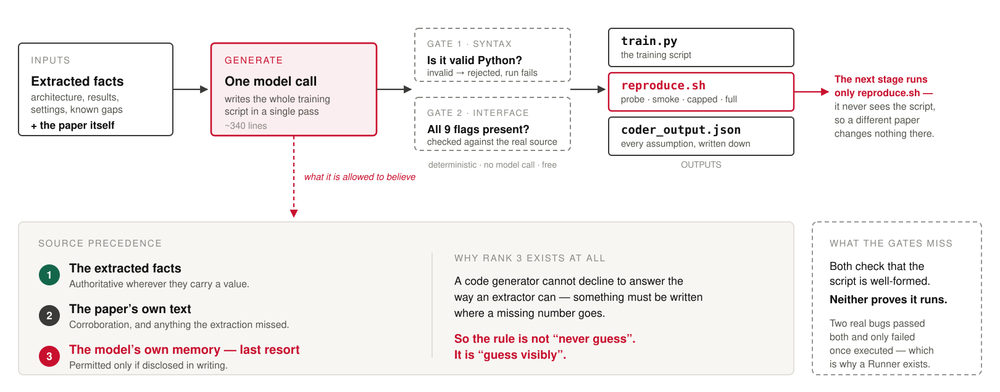

# Handouts

Five one-page explainers, one per pipeline stage plus a summary. Written for a
non-specialist reader — a friend, a teammate on another project, anyone who wants to
know what ReproBot does without reading the code.

| Sheet | Covers |
|---|---|
| `01-ocr` | Turning the paper PDF into text |
| `02-reader` | Turning that text into structured facts |
| `03-coder` | Writing the training code |
| `04-runner` | Running it safely in a container |
| `05-summary` | What changed between the two progress reports, and what's blocking |

Each exists as `.html` (opens in a browser, supports dark mode) and `.pdf` (one A4
page, ready to print or send).

## Slide graphic

`coder-diagram.svg` is a title-less diagram of the Coder stage, sized to drop straight
into a presentation under your own slide heading. Also rendered as PNG at 1x and 2x with
transparent backgrounds, so it sits on any slide colour.

Use the SVG where the tool supports it (Keynote, PowerPoint, Google Slides all do) — it
stays sharp at any projection size. Regenerate the PNGs after editing the SVG:

```bash
cd docs/handouts
printf '<style>html,body{margin:0;background:transparent}img{display:block}</style>\n' > _wrap.html
"/Applications/Google Chrome.app/Contents/MacOS/Google Chrome" --headless=new --disable-gpu \
  --screenshot="coder-diagram.png" --window-size=1620,636 \
  --default-background-color=00000000 --hide-scrollbars "file://$PWD/_wrap.html"
rm _wrap.html
```

## Regenerating

`01-ocr.html` was hand-written; sheets 02–05 come from `generate.py`, which holds the
shared CSS once so the set stays visually consistent.

```bash
python3 docs/handouts/generate.py

for f in 02-reader 03-coder 04-runner 05-summary; do
  "/Applications/Google Chrome.app/Contents/MacOS/Google Chrome" \
    --headless=new --disable-gpu --no-pdf-header-footer \
    --print-to-pdf="docs/handouts/$f.pdf" --virtual-time-budget=8000 \
    "file://$PWD/docs/handouts/$f.html"
done
```

Two things in the CSS are load-bearing and easy to break:

- **Bullet markers are absolutely positioned, never grid or flex siblings.** In a grid
  `li`, the `<strong>` lead and the sentence after it become separate grid items and get
  dealt into different cells — which wraps the text one word per line.
- **The `@media print` block is what makes a one-pager one page.** Without it the card
  border, page background and outer padding push content onto a second sheet.
