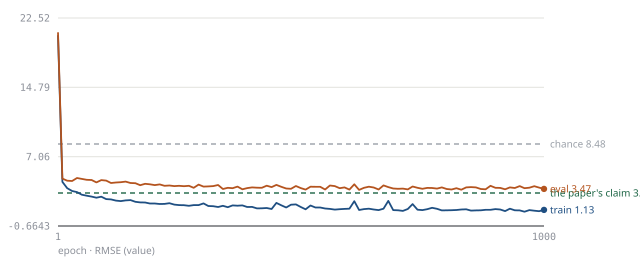

# 2023-10 - Multi Level Dense Layer Neural Network Model for Housing Price Prediction

**reproduced** — RMSE 2.76299 against the paper's 3.02, tolerance ±0.005 and better than the claim.

| | |
|---|---|
| Fidelity verdict | `pass` |
| Execution verdict | `success` |
| Attempts | 1 (0 retries of 3 allowed) |
| Method fidelity (reviewed) | `faithful` |

## Claims

The Reader extracted **4 claims**, which merge into **4 distinct results**. One run targets one of them; the rest are listed so the untested remainder is visible.

| Claim | Metric | Dataset | Paper | ReproBot | Verdict |
|---|---|---|---|---|---|
| `c1` | R^2 | Boston Housing Dataset | 0.91 | — | `not tested` |
| `c2` | MSE | Boston Housing Dataset | 9.16 | — | `not tested` |
| `c3` | RMSE | Boston Housing Dataset | 3.02 | **2.76299** | `pass` ↑ |
| `c4` | MAE | Boston Housing Dataset | 2.31 | — | `not tested` |

## Learning curve



101 records from the judged run, RMSE per epoch. Dashed lines mark the paper's claim (3.02) and chance (8.48087).

## The gap, and what is noise

| | |
|---|---|
| Paper claims | 3.02 |
| ReproBot | 2.76299 |
| Gap | -0.257 (-8.5%) |
| Tolerance | ±0.005 — reporting precision only (single run, no noise estimate) |

**Why this verdict:** the reproduced value is better than the claim beyond tolerance - the claimed result is achievable with this implementation

## Does the code match the paper?

Reviewed by `claude-opus-5`: **faithful**. The script implements the paper's multi-level dense network faithfully: BatchNorm on the 13 inputs, three parallel pairs of 128-unit ReLU Dense layers, per-level concat, one 128-unit Dense per level, a 384-dim concat and a single linear output (Figure 3 topology). Adam lr=0.001, 1000 epochs, z-score features fit on train only, 405/101 split and a 20% monitoring validation split all match stated values. Unstated items (batch size 32, MSE loss, random split assignment, PyTorch init, Figure-3 output stage) are disclosed. The test RMSE 2.763 beats the claimed 3.02; the model clearly overfits (train RMSE 1.85, monitoring RMSE 3.47) but the particular seeded 101-row test split is easier than the paper's.

### Matches the paper

- **architecture** — Six 128-unit ReLU layers in parallel pairs, three 128-unit layers at level 2, BatchNorm on the input and a final single-unit output reproduce the described topology (10 dense layers counting dense_9).
- **architecture (concatenations)** — Three per-level concatenations plus concatenate_3 across the levels match Figure 3's four concatenation operations.
- **optimizer / learning rate** — Adam at lr=0.001 constant, as stated; eps set to Keras' 1e-7 since the paper used TensorFlow (a disclosed, negligible detail).
- **epochs** — 1000 epochs were run to completion (epochs_completed=1000) with no early stopping or checkpoint selection, exactly as the paper specifies.
- **validation split** — 20% of the 405 training rows (81 rows, matching monitoring_split_sample_counts num_eval_samples=81) is held out for monitoring only; gradients use X_fit, so the validation rows never enter training.
- **preprocessing** — Eq. 5 applied to features, with mean/std fitted on the 405 training rows only and applied to the test rows — no leakage.
- **evaluation metric** — RMSE on raw MEDV units computed on the 101-row held-out test split in eval mode is reported as the claim value (2.763), matching Eq. 4 and the Table 3 protocol.
- **data source** — OpenML 'boston' v1 with asserted 506 rows and 13 feature columns matches Table 1's 14 attributes (13 features + MEDV); the paper names no loader.

### Choices the paper never states

- **architecture (final output stage)** — The paper's Figures 2 and 3 disagree on the final stage; the script chose Figure 3 (single terminal Linear(384,1), no activation) and disclosed it. The alternative (1-neuron Hidden layer 3 + concat + output) would change the final stage's capacity slightly.
- **data split assignment** — The paper gives only the 405/101 counts, not how rows are assigned. A single seeded permutation (seed=42) decides which 101 houses are tested; on a 506-row dataset this choice alone can move test RMSE by several tenths, which plausibly explains the reproduced 2.763 landing below the claimed 3.02.
- **loss function** — The paper never names the training loss; MSE is a reasonable default for a regression net whose own curves (Figure 4) plot MSE/MAE, and it is disclosed as an assumption.
- **target scaling** — Only features are standardised; MEDV is left in raw $1000s units, which is required for the reported RMSE to be comparable with Table 3's ~3 scale. Disclosed as an assumption.

*3 further finding(s) failed the Critic's citation checks and are omitted; they are kept in `critic_output.review` with the check that failed.*

## What was run

| | |
|---|---|
| Task | regression |
| Model family | neural |
| Dataset | Boston Housing Dataset, fetched via OpenML fetch_openml(name='boston', version=1, data_home=args.data_dir, as_frame=True) — this is the classic 506-row, 13-feature + MEDV target Boston housing dataset matching Table 1's 14 attributes. After fetching, the script asserts the frame has 506 rows and 13 feature columns (+1 target) and raises a clear error otherwise. Split: first 405 samples as training data and remaining 101 as test data per data_pipeline.split_convention ('From the original 506 samples, 405 samples are treated as training data and 101 samples are treated as test data'); since the paper does not state how rows were assigned to train/test (sequential vs shuffled), a seeded random permutation (seeded from --seed) is used to select 405/101 rows, logged accordingly, and recorded as an assumption. Features are z-score normalized (Eq. 5) using mean/std computed on the training split only, then applied to both splits (replicating TensorFlow's standard normalization layer behavior, fit on train only to avoid leakage per rule 8). The target MEDV is NOT normalized (paper does not state target normalization; RMSE/MAE/MSE are reported in original price units in Table 3, so training should optimize/evaluate in original units or de-normalize predictions before computing metrics — here the target is left unscaled and MSE loss is computed directly on raw MEDV values, matching Figure 4's MAE/MSE axis ranges of tens, consistent with un-normalized targets). |
| Targeted claim | c3 |
| Final script | version 1, `coder/output-e2e/run1/2023-10 - Multi Level Dense Layer Neural Network Model for Housing Price Prediction/train.py` |

### Settings the paper never states (14)

<details><summary>The Coder recorded every one of these</summary>

- unstated_details: final output stage ambiguity (Figure 2's dense+concat+output 3-stage vs Figure 3's single dense_9) - implemented Figure 3's single terminal Linear(384,1) layer as the output layer because Figure 3 is explicitly described as 'the actual generated network' via Keras plot_model, making it the more authoritative source for exact topology.
- unstated_details: output layer activation function not stated - used linear/no activation because this is a regression task predicting an unbounded continuous price.
- unstated_details: weight initialization scheme not stated - used PyTorch's default Kaiming-uniform init for nn.Linear layers as the standard era-appropriate default.
- unstated_details: whether biases are used per dense layer not stated - used bias=True (default) for all Linear layers, consistent with Eq. 6's explicit bias term b.
- unstated_details: BatchNorm momentum/epsilon/affine not stated - used PyTorch defaults (momentum=0.1, eps=1e-5, affine=True) since no other value is given.
- unstated_details: no dropout mentioned - omitted dropout entirely, per rule 7 (nothing the paper does not state).
- unstated_details: Hidden layer 3 width conflicting (1-neuron per Figure 2 vs 128 per general caption) - resolved by following the Figure-3 topology entirely (no separate Hidden-layer-3 128-unit layer, no extra 1-neuron layer); only the final dense_9 Linear(384,1) exists, consistent with the chosen Figure-3 interpretation.
- data source: paper names only 'Boston Housing Dataset' with no loader - used sklearn.datasets.fetch_openml(name='boston', version=1) because it is the standard maintained source for this exact classic dataset (506 rows, 13 features + MEDV target), with an assertion checking row/column counts after fetch.
- split method unstated: paper states 405 train / 101 test counts but not the assignment procedure - used a seeded random permutation (np.random.RandomState(seed)) to select 405 training and 101 test rows, logged at startup; the resulting RMSE depends on this random split choice.
- framework: paper used TensorFlow/Keras (data normalization explicitly 'via TensorFlow inbuilt function', Fig. 3 is a Keras plot_model diagram) - Keras Adam defaults eps=1e-7 vs PyTorch's default eps=1e-8; set eps=1e-7 explicitly in torch.optim.Adam to match the original framework's behavior.
- framework: Keras Model.fit defaults batch_size=32 when unstated; paper does not state a batch size, so batch_size=32 was used to match the likely Keras training setup.
- batch size not stated anywhere in the paper per validation flags - used Keras default of 32 as described above.
- target scaling: paper does not state whether MEDV is normalized before training - left target unscaled (raw MEDV, in $1000s) since Table 3's MSE/RMSE values (~9/~3) and Figure 4's MSE/MAE axis scales (range up to 600/25) are only consistent with errors computed in raw MEDV units, not standardized units.
- 20%-of-training validation split (Section 3.3) relationship to the 405/101 train/test split is unreconciled per data_pipeline notes - implemented the 20% validation split as an additional seeded random subset carved out of the 405-sample training set purely for epoch-wise monitoring (not used for gradient updates or for the reported train/test metrics), to stay faithful to the stated training procedure without altering the final evaluation protocol that produces c3's reported value.

</details>

## How it got there

| # | Ran to | Status | Critic | Time | Why it stopped or retried |
|---|---|---|---|---|---|
| v1 | `full` | `success` | `pass` | 107 s | a stage passed; nothing to retry; critic verdict: pass |

## Reproduce this reproduction

```bash
cd coder/output-e2e/run1/2023-10 - Multi Level Dense Layer Neural Network Model for Housing Price Prediction
bash reproduce.sh full          # the paper's own setup
bash reproduce.sh seed2         # the same run, another seed
```

Or drive the whole loop again, from the Reader's output:

```bash
uv run python -m orchestrator.pipeline \
    --input "reader/output/2023-10 - Multi Level Dense Layer Neural Network Model for Housing Price Prediction.json" --max-stage full --force
```

---<sub>Run started 2026-10-09T13:35:26+00:00, finished 2026-10-09T13:39:28+00:00. Container logs: `orchestrator/output-e2e/run1/2023-10 - Multi Level Dense Layer Neural Network Model for Housing Price Prediction/logs/attempt-1`. Generated by `report/` from the Orchestrator's state object; every number is copied from it, none computed here.</sub>
