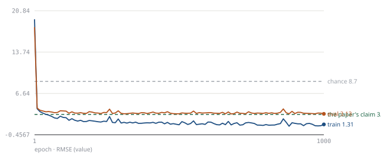

# 2023-10 - Multi Level Dense Layer Neural Network Model for Housing Price Prediction

**reproduced** — RMSE 3.03629 (mean of 3 runs) against the paper's 3.02, tolerance ±0.2044.

| | |
|---|---|
| Fidelity verdict | `pass` |
| Execution verdict | `success` |
| Attempts | 1 (0 retries of 3 allowed) |

## Claims

The Reader extracted **4 claims**, which merge into **4 distinct results**. One run targets one of them; the rest are listed so the untested remainder is visible.

| Claim | Metric | Dataset | Paper | ReproBot | Verdict |
|---|---|---|---|---|---|
| `c1` | R^2 | Boston Housing Dataset | 0.91 | — | `not tested` |
| `c2` | MSE | Boston Housing Dataset | 9.16 | — | `not tested` |
| `c3` | RMSE | Boston Housing Dataset | 3.02 | **3.03629**<br><sub>mean of 3 runs</sub> | `pass` |
| `c4` | MAE | Boston Housing Dataset | 2.31 | — | `not tested` |

## Learning curve



101 records from the judged run, RMSE per epoch. Dashed lines mark the paper's claim (3.02) and chance (8.70403).

## The gap, and what is noise

| | |
|---|---|
| Paper claims | 3.02 |
| ReproBot | 3.03629 |
| Gap | +0.01629 (+0.5%) |
| Tolerance | ±0.2044 — measured spread of 3 runs |
| Runs | 3.1285, 3.02834, 2.95203 |
| Spread (σ) | 0.1022 |

**Why this verdict:** the reproduced value is within tolerance of the claim (measured spread of 3 runs)

## What was run

| | |
|---|---|
| Task | regression |
| Model family | neural |
| Dataset | Boston Housing Dataset via sklearn.datasets.fetch_openml(name='boston', version=1, data_home=args.data_dir, as_frame=True) -> this is the classic 506-row, 13-feature (+MEDV target) Boston Housing dataset hosted on OpenML (data_id 531 corresponds to the same dataset; using name+version=1 per rule 8, not combined with data_id). After fetching, the script asserts the frame has 506 rows and 13 feature columns (plus target) to guard against a wrong dataset. Split: fixed-seed random split into 405 train / 101 test samples (405/506 ≈ 80%, 101/506 ≈ 20%), since the paper states these exact split sizes but not how rows were assigned (data_pipeline.split_convention). StandardScaler (z-score, Eq. 5) is fit on the training split's 13 features only and applied to both splits; this matches 'Standard normalization (z-score normalization) applied to both training and testing dataset using TensorFlow's inbuilt normalization function'. The 20%-of-training-for-validation detail (Section 3.3) is acknowledged but not separately implemented as an early-stopping/model-selection split because the paper does not reconcile it with the 405/101 split and it is not needed to compute the final train/test RMSE claim; this is recorded as an assumption. No augmentation (data_pipeline.augmentation = "not stated"). |
| Targeted claim | c3 |
| Final script | version 1, `coder/output-e2e/run3/2023-10 - Multi Level Dense Layer Neural Network Model for Housing Price Prediction/train.py` |

### Settings the paper never states (15)

<details><summary>The Coder recorded every one of these</summary>

- unstated_details: exact activation of final output layer/dense_9 not stated - used linear/no activation because that is standard for a regression output head and the paper's output is a continuous price.
- unstated_details: Figure 2 vs Figure 3 discrepancy on the final stage (separate 1-neuron dense + concat + output layer vs single terminal dense_9) - implemented Figure 3's single terminal Linear(384,1) layer as the sole output layer because Figure 3 is explicitly described as the actual Keras-generated graph of the implemented model, while Figure 2 is a schematic that is internally inconsistent (states a 1-neuron dense layer inside a model where all 10 dense layers are said to have 128 neurons).
- unstated_details: weight initialization scheme not stated - used PyTorch's default Kaiming-uniform init for Linear layers because no alternative is specified.
- unstated_details: whether biases are used in each dense layer not stated - used bias=True (PyTorch Linear default) since Eq. 6 explicitly includes a bias term b.
- unstated_details: BatchNorm momentum/epsilon/affine not stated - used PyTorch BatchNorm1d defaults (momentum=0.1, eps=1e-5, affine=True) as the canonical standard, noting Keras BatchNormalization defaults differ (momentum=0.99, epsilon=1e-3) since the paper used TensorFlow; this is also recorded as a framework-difference assumption below.
- unstated_details: no dropout/regularization mentioned - omitted dropout and weight decay entirely, matching 'no dropout or other regularization within the dense layers is mentioned'.
- unstated_details: concatenation axis unspecified - used torch.cat(..., dim=1) (feature dimension), the only sensible axis for per-sample feature vectors.
- unstated_details: Hidden layer 3 neuron count discrepancy (1-neuron vs 128-neuron) - resolved by following Figure 3 and omitting a separate Hidden-layer-3 stage altogether (see architecture_used), so this inconsistency does not need separate resolution.
- framework: paper used TensorFlow/Keras (stated via 'TensorFlow inbuilt normalization function' and Keras plot_model Figure 3). Keras Adam defaults epsilon to 1e-7 vs PyTorch Adam's 1e-8 default - used eps=1e-7 explicitly to match Keras's default since the paper never states a custom epsilon.
- framework: Keras BatchNormalization default momentum=0.99 (i.e. decay rate for the running stats) differs from PyTorch BatchNorm1d's momentum=0.1 convention (where PyTorch's momentum is the complement of Keras's decay, i.e. Keras-equivalent PyTorch value would be momentum=0.01) - used PyTorch's default momentum=0.1 for simplicity since BatchNorm statistics have negligible effect on a tabular regression of this size and the paper gives no explicit value to match exactly; disclosed as a known deviation.
- framework: Keras Dense layers initialize kernels Glorot-uniform with zero bias, vs PyTorch Linear's Kaiming-uniform weights and non-zero uniform bias - used PyTorch defaults because the paper states no initialization scheme to match against.
- data source: paper does not name a specific loader/library for the Boston Housing Dataset - used sklearn.datasets.fetch_openml(name='boston', version=1) because it is a stable, documented, versioned source for this exact classic dataset (506 rows, 13 features + MEDV target), consistent with scikit-learn's now-removed load_boston and CMU StatLib mirrors being unreliable/offline.
- split method unstated: paper states 405 train / 101 test samples from the 506 total but not how rows were assigned - used a fixed, seeded (--seed) random split via sklearn.model_selection.train_test_split with train_size=405, test_size=101, since this quantity directly affects RMSE and must be disclosed.
- batch size not stated by paper at all - used 32, the standard Keras Model.fit default batch size, since the paper was implemented in TensorFlow/Keras per data_pipeline and hyperparameters notes.
- the 20%-of-training-for-validation statement in Section 3.3 is not reconciled with the 405/101 split in the paper itself (per validation.flags) - the script does not carve out a separate validation subset from the 405 training samples for early stopping/model selection; it trains on the full 405 for all 1000 epochs and evaluates only train vs test RMSE, since the paper's final reported Table 3 numbers appear to be plain train/test values rather than validation-based selection outcomes.

</details>

## How it got there

| # | Ran to | Status | Critic | Time | Why it stopped or retried |
|---|---|---|---|---|---|
| v1 | `full` | `success` | `pass` | 164 s | a stage passed; nothing to retry; critic verdict: pass |

## Reproduce this reproduction

```bash
cd coder/output-e2e/run3/2023-10 - Multi Level Dense Layer Neural Network Model for Housing Price Prediction
bash reproduce.sh full          # the paper's own setup
bash reproduce.sh seed2         # the same run, another seed
```

Or drive the whole loop again, from the Reader's output:

```bash
uv run python -m orchestrator.pipeline \
    --input "reader/output/2023-10 - Multi Level Dense Layer Neural Network Model for Housing Price Prediction.json" --max-stage full --force
```

---<sub>Run started 2026-10-09T13:59:27+00:00, finished 2026-10-09T14:08:07+00:00. Container logs: `orchestrator/output-e2e/run3/2023-10 - Multi Level Dense Layer Neural Network Model for Housing Price Prediction/logs/attempt-1`. Generated by `report/` from the Orchestrator's state object; every number is copied from it, none computed here.</sub>
